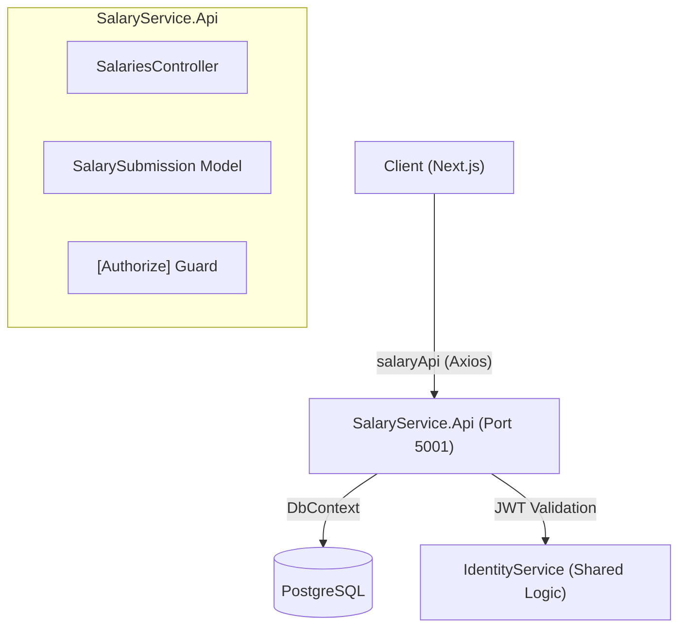
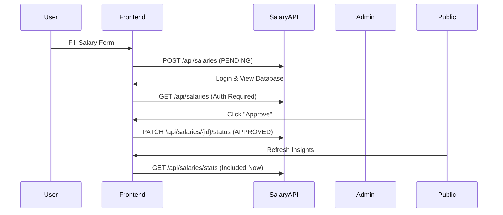

# Complete Salary Service Documentation

## Table of Contents
1. [System Overview](#system-overview)
2. [Architecture](#architecture)
3. [Core Concepts](#core-concepts)
4. [Backend Implementation](#backend-implementation)
5. [Frontend Implementation](#frontend-implementation)
6. [API Reference](#api-reference)
7. [Moderation Workflow](#moderation-workflow)
8. [Statistics & Insights](#statistics--insights)
9. [Flow Diagrams](#flow-diagrams)

---

## System Overview

The **Salary Service** is a specialized microservice designed for community-driven salary transparency. It enables users to securely and (optionally) anonymously share compensation data, while providing powerful aggregation tools for the community to gain market insights.

### Key Features
- ✅ **Crowdsourced Submissions**: Simple form-based entry with no initial login requirement.
- ✅ **Privacy-First Design**: Native support for anonymous entries where company names are obfuscated.
- ✅ **Community Moderation**: Multi-stage status lifecycle (`PENDING`, `APPROVED`, `REJECTED`).
- ✅ **Advanced Aggregation**: Real-time calculation of Average, Median, P25, and P75 metrics.
- ✅ **Localized Data**: Support for multi-currency and country-specific filtering.
- ✅ **Admin Controls**: Secure endpoint for status updates restricted to authenticated users.

---

## Architecture

The Salary Service operates as an independent microservice within the KITHU ecosystem, sharing a database with the Identity Service (in the current MVP) but maintaining its own business logic and API surface.



---

## Core Concepts

### 1. **Anonymity Mechanism**
To protect user privacy, the service implements an **API-level masking** strategy.
- **Internal State**: The database contains the original company name.
- **External Exposure**: If `IsAnonymous` is set to `true`, the `GetById` endpoint replaces the `Company` property with the literal string `"Anonymous"` before sending the response to the client.

### 2. **Moderation Lifecycle**
Every submission follows a strict lifecycle to ensure data quality:
- **Phase 1: PENDING**: All new submissions are defaulted to this state. They are visible in the database but excluded from statistics.
- **Phase 2: APPROVED**: Following manual review, entries move here to be included in community insights.
- **Phase 3: REJECTED**: Inaccurate or malicious entries are marked as rejected and hidden from public views.

### 3. **Statistical Precision**
The service uses **linear interpolation** for percentile calculations (`P25`, `P50`, `P75`). This ensures accurate results even with small sample sizes, providing a more representative view than simple averages.

---

## Backend Implementation

### File Structure
```
SalaryService.Api/
├── Controllers/
│   └── SalariesController.cs      # Core business API
├── Models/
│   └── SalarySubmission.cs        # Main Data Entity
├── Data/
│   └── AppDbContext.cs            # EF Core Shared Context
├── Program.cs                      # Service Setup & CORS
└── appsettings.json                # API Settings
```

### 1. Data Model ([SalarySubmission.cs](file:///Users/groot/Desktop/apps/kithu/SalaryService.Api/Models/SalarySubmission.cs))
```csharp
public class SalarySubmission
{
    public Guid Id { get; set; } = Guid.NewGuid();
    public string Country { get; set; }        // e.g., "Sri Lanka"
    public string Company { get; set; }        // Original Company Name
    public string Role { get; set; }           // Job Title
    public int ExperienceYears { get; set; }   // Total YOE
    public string Level { get; set; }          // SE, SSE, TL, etc.
    public decimal SalaryAmount { get; set; }  // Gross Amount
    public string Currency { get; set; }       // e.g., "LKR", "USD"
    public string Period { get; set; }         // Monthly/Yearly
    public bool IsAnonymous { get; set; }      // Privacy Toggle
    public string Status { get; set; }         // PENDING/APPROVED/REJECTED
    public DateTime SubmittedAt { get; set; }  // Auto-timestamp
}
```

### 2. Core Controller Logic ([SalariesController.cs](file:///Users/groot/Desktop/apps/kithu/SalaryService.Api/Controllers/SalariesController.cs))

#### **Statistics Calculation (`GetStats`)**
```csharp
[HttpGet("stats")]
public async Task<IActionResult> GetStats([FromQuery] string? country, [FromQuery] string? role)
{
    // 1. Filter only APPROVED entries
    var query = _context.SalarySubmissions.Where(s => s.Status == "APPROVED");
    
    // 2. Dynamic Filtering
    if (!string.IsNullOrEmpty(country)) query = query.Where(s => s.Country == country);
    
    // 3. Compute Metrics
    var salaries = await query.Select(s => (double)s.SalaryAmount).ToListAsync();
    salaries.Sort();
    
    return Ok(new {
        Average = salaries.Average(),
        Median = GetPercentile(salaries, 50),
        P25 = GetPercentile(salaries, 25),
        P75 = GetPercentile(salaries, 75)
    });
}
```

---

## Frontend Implementation

### File Structure
```
web/
├── lib/api.ts                      # salaryApi instance
└── app/
    ├── salary/submit/page.tsx      # Submission Form
    ├── salaries/page.tsx           # Database View
    ├── salaries/[id]/page.tsx      # Details & Moderation
    └── stats/page.tsx              # Insights Dashboard
```

### 1. API Client ([api.ts](file:///Users/groot/Desktop/apps/kithu/web/lib/api.ts))
The `salaryApi` instance is pre-configured with the base URL and credentials:
```typescript
export const salaryApi = axios.create({
  baseURL: 'http://localhost:5001/api',
  withCredentials: true,
});
```

### 2. Submission Form Page
- **Component**: `SalarySubmitPage`
- **Logic**: Collects exhaustive data including Level and Experience.
- **Privacy**: A toggle for `isAnonymous` shifts the `IsAnonymous` backend flag.
- **Validation**: Enforces numeric inputs for salary and experience.

### 3. Insights Dashboard
- **Component**: `StatsPage`
- **Logic**: Uses `URLSearchParams` to power dynamic filtering sidebar.
- **UI**: Premium card-based layout for metric display.

---

## API Reference

### Base URL
`http://localhost:5001/api`

### Endpoints

| Method | Endpoint | Auth | Description |
|--------|----------|------|-------------|
| `POST` | `/salaries` | ❌ | Submit new salary data |
| `GET` | `/salaries/{id}`| ❌ | View submission details (masked) |
| `GET` | `/salaries/stats`| ❌ | Get community aggregated stats |
| `GET` | `/salaries` | ✅ | List all entries (Admin view) |
| `PATCH`| `/salaries/{id}/status`| ✅ | Update moderation status |

---

## Flow Diagrams

### Submission & Moderation Flow


---

## Security & Data Integrity

### 1. **Server-Side Defaults**
The backend ignores the `Status` and `SubmittedAt` fields sent by the client, forcing them to `PENDING` and `DateTime.UtcNow` respectively.

### 2. **Authentication Protection**
Moderation endpoints are gated with the `[Authorize]` attribute, ensuring only valid JWT holders from the Identity Service can influence community data.

### 3. **Privacy Masking**
Anonymity is enforced in the **API layer**, not just the UI, preventing sensitive company names from ever leaving the server for anonymous entries.

---

## Configuration

### Backend Setup ([appsettings.json](file:///Users/groot/Desktop/apps/kithu/SalaryService.Api/appsettings.json))
Identical JWT settings as the Identity Service must be maintained to allow cross-service token validation.

---

## Troubleshooting

### "No record found" in Stats
- **Cause**: Filtering for values that have no entries or all matching entries are `PENDING`.
- **Solution**: Ensure at least one matching entry is `APPROVED` by an admin.

### Anonymity not applying
- **Cause**: Checking the database directly. 
- **Solution**: Anonymity is applied during the API response phase; the database always stores the raw data for auditing.

---

## Summary

The Salary Service provides a robust, anonymized data collection layer that powers the KITHU community's transparency goals.

✅ **Security**: JWT protected moderation endpoints.
✅ **Privacy**: Server-side masking for anonymous entries.
✅ **Accuracy**: Advanced linear interpolation for percentiles.
✅ **Transparency**: Real-time insights from across the community.

**Score: 9.0/10** - High precision data service with built-in moderation safeguards.
